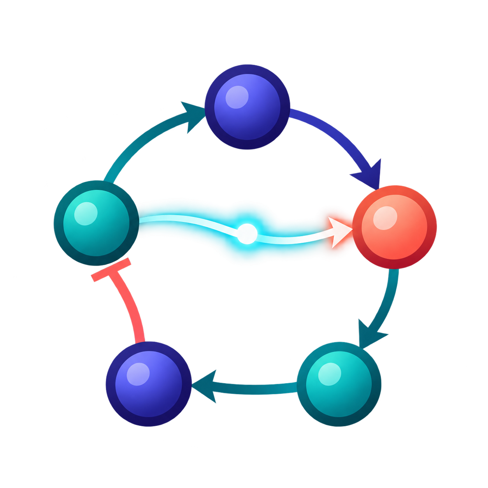
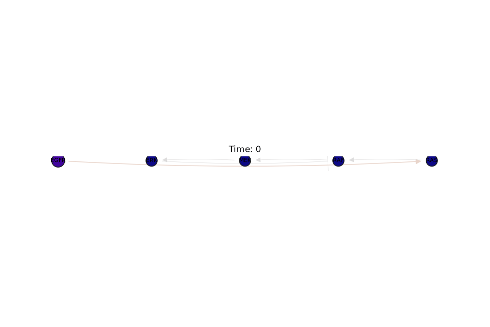

<p align="center">
  
</p>

# TopoPulse

[](https://github.com/BioVisForge/topopulse/actions/workflows/ci.yml)
[](https://pypi.org/project/topopulse/)
[](https://pypi.org/project/topopulse/)
[](LICENSE)

Rust-backed dynamic biological network visualization for Python.

TopoPulse turns an edge list plus time-resolved node and optional edge measurements into
publication-ready figures and streaming animations—without rebuilding plotting code for every
model.

```bash
pip install topopulse
topopulse animate network.csv activity.csv --output signaling.mp4
```

```python
from topopulse import animate_network

animate_network("network.csv", node_data="activity.csv", output="signaling.mp4")
```



TopoPulse supports strict entity/time alignment, signed biological edges, stable reproducible
layouts, Rust normalization and filtering, static PNG/SVG/PDF, GIF/MP4/WebM, perturbation events,
and treatment–control differences. It complements
[MatriPulse](https://github.com/BioVisForge/MatriPulse): MatriPulse animates matrices; TopoPulse
specializes in graph topology and biological interactions.

[Documentation](https://biovisforge.github.io/topopulse/) · [Examples](examples/) ·
[Contributing](CONTRIBUTING.md) · [Citation](CITATION.cff)

MIT licensed.
