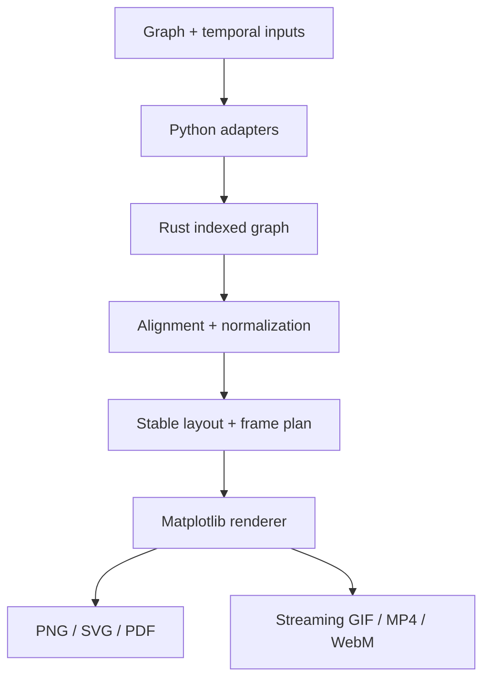

# Architecture

The FFI boundary passes contiguous numeric arrays and integer indices. Biological strings are
mapped once, not once per frame. NetworkX is an adapter and small-graph layout helper, not the
computational graph backend.

